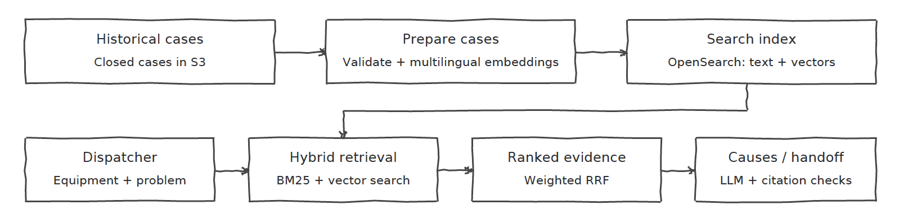

# Diagnostic Assist Technical Design

This design keeps the first version small enough to build and evaluate. It has an offline path for preparing historical cases and an online path for finding useful evidence during a customer call.

## Architecture and pipeline

The offline path validates closed cases, creates multilingual embeddings from customer descriptions and indexes the records for keyword and vector search.

The online path starts when the dispatcher enters an equipment type and problem description. In production, BM25 and vector search would run in parallel. Weighted Reciprocal Rank Fusion combines their results into a ranked evidence bundle.

The first useful evidence should appear within three seconds at p95. Cause grouping and follow-up generation can arrive afterward.



I would begin with a modular application rather than separate microservices. The current volume does not justify the additional deployment and operational work.

## Data handling

The unchanged source cases would be stored in versioned S3 storage. A separate searchable record would be created for OpenSearch.

Only `customer_description` is used for matching. Technician notes, resolution text and replaced parts were created after the technician diagnosed the machine. Including them in the searchable text would leak the historical answer into retrieval.

A searchable record would look like this:

```json
{
  "case_id": "C-48590",
  "equipment_family": "Air Compressor CX",
  "equipment_type": "CX-450",
  "created_at": "2026-01-27T09:41:00Z",
  "language": "en",
  "customer_description": "no crank, dead panel",
  "customer_description_vector": [],
  "technician_notes": "Ground strap was loose...",
  "resolution_text": "Loose ground strap...",
  "parts_replaced": [],
  "pipeline_version": "1"
}
```

OpenSearch would store the searchable text, vector and metadata. The outcome fields would be returned only after retrieval as historical evidence.

The source data has no root-cause field or symptom taxonomy. I would not silently write LLM-generated labels back to the historical cases. Any generated cause must cite the case ID and exact text that supports it.

## Retrieval algorithms

BM25 is used for exact error codes, part numbers, model names and technical terms. Semantic retrieval is useful when two descriptions have the same meaning but use different words or languages.

The prototype uses `paraphrase-multilingual-MiniLM-L12-v2` so it can run locally. In production, I would use Cohere Embed Multilingual through Amazon Bedrock behind the same embedding interface. A multilingual model avoids translating every case into English, which would add cost and could change technical terms.

Production vector search would use HNSW approximate nearest neighbours in OpenSearch. Exact vector search could work for 100,000 records, but HNSW provides more predictable latency as the index grows. Its cost is that approximate search can miss a relevant neighbour.

Retrieval follows these steps:

1. Search cases from the same equipment type.
2. Run BM25 and multilingual semantic retrieval.
3. Take the leading candidates from both result lists.
4. Combine them with weighted Reciprocal Rank Fusion.
5. Return the original cases and their outcome evidence.

RRF uses rank positions instead of comparing BM25 and cosine scores directly. Those scores have different meanings and scales. The implementation uses the standard rank constant of 60, which I did not tune on this small sample.

The prototype takes five candidates from each retrieval method. BM25 has a fusion weight of `1.0` and semantic retrieval has a weight of `2.0`. I selected this configuration through a small leave-one-out experiment. These are prototype choices, not production-tuned parameters.

The prototype expands to the equipment family when it cannot return the requested number of equipment-type candidates. This is a coverage fallback, not a relevance-based decision. A production system should use a multilingual reranker before deciding that the type-specific evidence is too weak.

A reranker would improve precision, but it adds latency, another model and another threshold to evaluate. I left it outside the implemented component and kept the remaining false positives visible.

## Causes, probabilities and follow-ups

An RRF or vector score is not the probability that a root cause is correct.

After retrieval, a constrained LLM could group historical outcomes into temporary candidate causes. Each cause must cite its supporting case IDs and source text. The backend would reject citations that are not present in the retrieved evidence.

For the prototype, I would show ranked causes, supporting case counts and the historical evidence. I would not display a diagnostic percentage because the data has no confirmed root-cause labels and the sample is too small for calibration.

Production probabilities would require a human-reviewed cause dataset. Historical cases could then be tested by hiding technician notes and resolutions, predicting from only the information available before the visit and calibrating the model on a later temporal holdout set. I would measure Brier score and calibration error before showing the result as a probability.

The LLM may also return one follow-up question when its answer could separate the current possibilities. `Unknown` is always valid and should not count as evidence. Questions requiring tools, measurements, specialist knowledge or unsafe actions should be left for the technician.

## Initial and daily processing

The initial 100,000 cases are small enough for a batch job running on ECS Fargate:

1. Read cases from S3 in batches.
2. Validate them using Pydantic.
3. Generate customer-description embeddings in batches.
4. Store processed records in S3.
5. Bulk-index the records into OpenSearch.

`case_id` and `pipeline_version` make the process idempotent. Retrying a batch updates its records instead of creating duplicates.

The prototype loader fails fast when any input record is invalid. In production, invalid or repeatedly failing records would be written to a separate S3 prefix so one bad case does not stop the complete import.

For approximately 500 new closed cases per day, EventBridge Scheduler would start the same incremental job. Streaming infrastructure is unnecessary at this volume.

When the embedding model or indexing logic changes, I would build and validate a new index and switch an OpenSearch alias after it passes evaluation. This avoids partially updating the live index.

## Three-second response

The three-second requirement applies to the first useful output, not the complete generated response.

Historical embeddings would be calculated offline. The API would remain warm on ECS Fargate, BM25 and vector retrieval would run concurrently, and only a small candidate set would be fused. The UI could first show historical evidence and then add slower causes or follow-up suggestions.

I would measure p50 and p95 latency separately for query embedding, BM25, vector search, fusion and generation.

The local CLI loads the embedding model and builds an in-memory index during execution, so it is not a latency benchmark. The three-second target applies to the proposed production service.

## AWS and application stack

| Area | Choice and cost |
|---|---|
| Storage | S3 for immutable raw data, processed records and rejected records |
| Search | OpenSearch for BM25, HNSW vectors and metadata filters; its fixed cost may be high for this corpus |
| Models | Amazon Bedrock for embeddings and generation; simpler operations but creates provider cost and dependence |
| Backend | Python, FastAPI, Pydantic, boto3 and `opensearch-py` |
| Compute | ECS Fargate for the warm API and scheduled batch jobs |
| State | DynamoDB for conversation state and feedback |
| Frontend | React and TypeScript |
| Operations | EventBridge, CloudWatch, OpenTelemetry and Terraform or CDK |

PostgreSQL with `pgvector` could be cheaper if retrieval remains simple. OpenSearch is the stronger choice when keyword search, vector search and metadata filtering must be served together.

## Failure modes

| Failure | Detection or control |
|---|---|
| Invalid or missing data | Validation errors, rejected-record counts and source/index count comparison |
| Weak multilingual retrieval | Recall@5 reported separately by language |
| Exact codes are missed | Dedicated BM25 tests for formats such as `E-207` and `E207` |
| Irrelevant evidence is returned | Human relevance judgements, Precision@5 and nDCG |
| Unsupported causes are generated | Validate cited case IDs and exact supporting text |
| Rare equipment has little history | Metrics by equipment volume and visible family fallback |
| Requests are slow | p50/p95 tracing for every retrieval and generation stage |

When evidence is weak, the system should say that an onsite diagnosis is required. A confident unsupported answer is a more serious failure than returning no diagnosis.

## Component selected for implementation

I implemented multilingual hybrid retrieval and evidence assembly as the riskiest component. Every cause, probability estimate and follow-up question depends on retrieving relevant historical evidence first.

The prototype implements validation, BM25, multilingual semantic retrieval, equipment filtering, weighted RRF, family fallback, query-case exclusion and structured evidence output.

Leave-one-out testing exposed a real failure: semantic retrieval found relevant German cases, but the original fusion pushed them below weaker English cases. Adjusting the candidate depth and semantic weight recovered the German case in the tested query. Some irrelevant results remained, which is why relevance reranking is the next retrieval improvement.

## How I would know it works

For the sample, I manually identified relevant cases for four queries and used leave-one-out evaluation. One historical case acts as a new query and is removed from the candidates so it cannot retrieve itself.

The experiment measured Recall@5, Precision@5 and cross-language retrieval. Candidate depth five produced average Recall@5 of `1.00` and Precision@5 of `0.65` in the tuning experiment.

These results are exploratory because the sample contains only 22 cases and I created the relevance judgements myself. In production, dispatchers or technicians should review a larger evaluation set covering every language, common and rare equipment, mixed-language queries and queries with no useful match.

I would reconsider the approach if cross-language recall remained materially worse than English, irrelevant cases regularly dominated the first results or the production response exceeded three seconds at p95.

## What I cut

Within the timebox, I did not implement:

- a multilingual relevance reranker;
- root-cause extraction and calibrated probabilities;
- follow-up generation;
- the dispatcher interface;
- AWS infrastructure and incremental ingestion;
- production load and latency testing.

I prioritised retrieval because downstream features cannot be trusted when their historical evidence is irrelevant. The next step would be reranking and an explicit insufficient-evidence response.

## AI use

I used AI to brainstorm architecture alternatives, improve the written explanation and suggest initial code and test structures. I reviewed and modified the implementation and ran the retrieval experiments myself.

AI suggested creating permanent LLM-generated root-cause labels for the historical cases. I did not use that approach because the supplied data has no confirmed root-cause field. Incorrect synthetic labels could silently affect future retrieval and probability estimates.

AI also suggested retrieving a larger candidate pool. In the small experiment, a depth of ten performed worse than a depth of five for cross-language coverage and precision, so I kept the smaller depth. I treated this as an experiment on the sample rather than assuming the suggestion was correct.